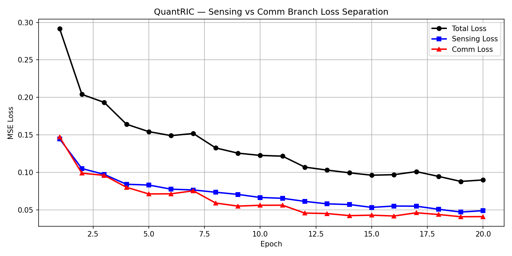
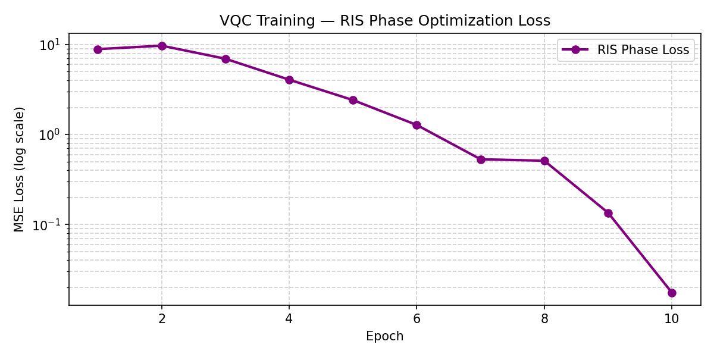
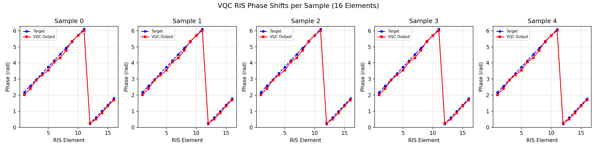
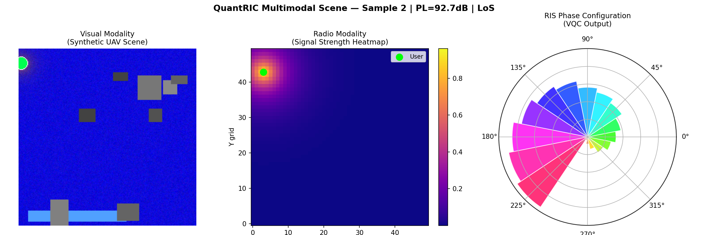
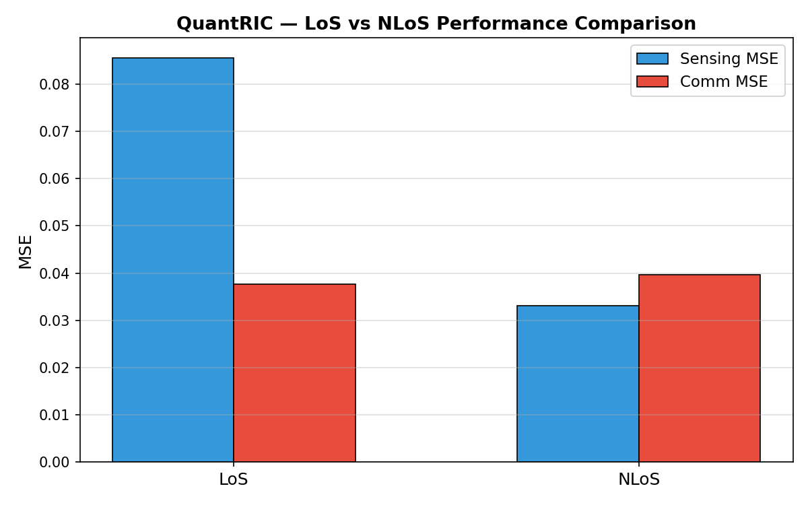
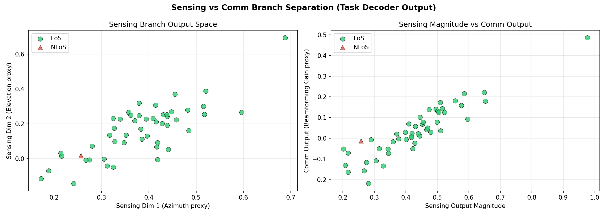

# QuantRIC: Hybrid Quantum-Classical Framework for Predictive ISAC-RIS Orchestration in 6G O-RAN

> A multimodal sensing and communication framework that fuses radio channel data with visual scene understanding, optimizing Reconfigurable Intelligent Surface (RIS) phase configurations via a Variational Quantum Circuit (VQC) within the O-RAN RIC orchestration loop.

---

## Overview

QuantRIC addresses three core challenges in 6G Integrated Sensing and Communication (ISAC) systems:

- **Blockage Resilience** — multimodal fusion of radio and visual data maintains performance under NLoS and stochastic signal blockages
- **Scalable RIS Management** — sparse cross-attention keeps complexity bounded as RIS arrays grow
- **Joint Sensing and Communication Optimization** — task-specific query tokens separate sensing and comm objectives; a VQC enforces unit-modulus RIS phase constraints natively via Bloch sphere geometry

---

## System Architecture

```
DeepMIMO Channel Data  →  Radio Transformer Encoder  →  (B, 7, 256)
Synthetic Scene Image  →  Frozen ViT + Projection    →  (B, 197, 256)
                                    ↓
                     Sparse Cross-Attention Fusion    →  (B, 256)
                                    ↓
                 Task Decoder (Sensing Query + Comm Query)
                          ↓                  ↓
                   Sensing (B,2)         Comm (B,1)
                          ↓                  ↓
                   Dual-Branch VQC (4 qubits × 4 runs)
                          ↓
                  RIS Phase Shifts (16 elements, 0 to 2π)
                          ↓
                   RIC Decision (RIS Configuration)
```
### 'B' represents the batch size of the training sample.
---

## Code Structure

```
QuantRIC/
│
├── src/
│   ├── __init__.py
│   ├── data_loader.py        # DeepMIMO .mat file loader (scipy)
│   ├── visual_encoder.py     # Synthetic scene generator + ViT feature extractor
│   ├── radio_encoder.py      # Small transformer encoder for radio features
│   ├── fusion.py             # Sparse cross-attention fusion + visual projection
│   ├── task_decoder.py       # Dual query token decoder (sensing + comm branches)
│   ├── vqc.py                # 4-qubit VQC (PennyLane) — dual branch design
│   ├── ris_vqc.py            # RIS phase optimizer — VQC training loop
│   ├── train.py              # Classical pipeline training loop
│   ├── visualize.py          # All plots and evaluation figures
│   └── plot_losses.py        # Training loss curves
│
├── data/
│   ├── deepmimo/             # DeepMIMO scenario files (not tracked)
│   └── visual/               # Synthetic scene images
│
├── deepmimo_scenarios/       # Raw .mat scenario files (not tracked)
├── main.py                   # Entry point
├── requirements.txt
└── README.md
```

---

## Installation

```bash
pip install deepmimo numpy torch torchvision transformers Pillow matplotlib pennylane scipy
```

---

## Dataset

This framework uses the **DeepMIMO O1_28B** scenario — an outdoor 28GHz ray-tracing dataset with 497,931 user locations containing:

- Complex channel matrices (CIR)
- Path loss per user
- Direction of Arrival (DoA) and Departure (DoD)
- Line-of-Sight (LoS) status
- 3D user locations

Download from [deepmimo.net](https://deepmimo.net) and place in `deepmimo_scenarios/o1_28b/`.

---

## Usage

**Train classical pipeline:**
```python
# in main.py
from src.train import train
train()
```

**Train VQC RIS optimizer:**
```python
from src.ris_vqc import train_vqc
train_vqc(num_samples=50, epochs=10, batch_size=4)
```

**Run full inference demo:**
```python
from src.visualize import end_to_end_demo
end_to_end_demo(sample_idx=2)
```

---

## Results

### Classical Training — Sensing vs Comm Loss Separation


### VQC Training — RIS Phase Optimization Loss


### VQC RIS Phase Shifts per Sample (Target vs Output)


### Multimodal Scene — Radio + Visual + RIS Configuration


### LoS vs NLoS Performance Comparison


### Sensing vs Comm Branch Separation


---

## Key Design Choices

**Why sparse cross-attention?** Full self-attention over RIS arrays scales as O(n²). Sparse attention keeps complexity tractable for large-scale 6G deployments.

**Why task-specific query tokens instead of MLP separation?** Learnable sensing and comm query tokens independently attend to the fused context during training, naturally specializing without requiring explicit feature disentanglement — a principled solution to the joint ISAC optimization problem.

**Why VQC for RIS phase optimization?** RIS phase shifts are unit-modulus constrained (must lie on the complex unit circle). The Bloch sphere geometry of quantum circuits natively operates in this bounded space, making VQC a natural and theoretically motivated choice for RIS phase control.

---

## Contributions

- Dual-encoder multimodal fusion via sparse cross-attention for blockage-resilient ISAC in 6G O-RAN
- Task-specific learnable query token decoder for principled sensing/comm separation
- Dual-branch 4-qubit VQC with angle encoding, local entanglement, cross-branch coupling, and global ring mixing for constrained RIS phase optimization

---

## Citation

```
@article{quantric2026,
  title   = {QuantRIC: Hybrid Quantum-Classical Framework for Predictive 
             ISAC-RIS Orchestration in 6G O-RAN},
  year    = {2026}
}
```

